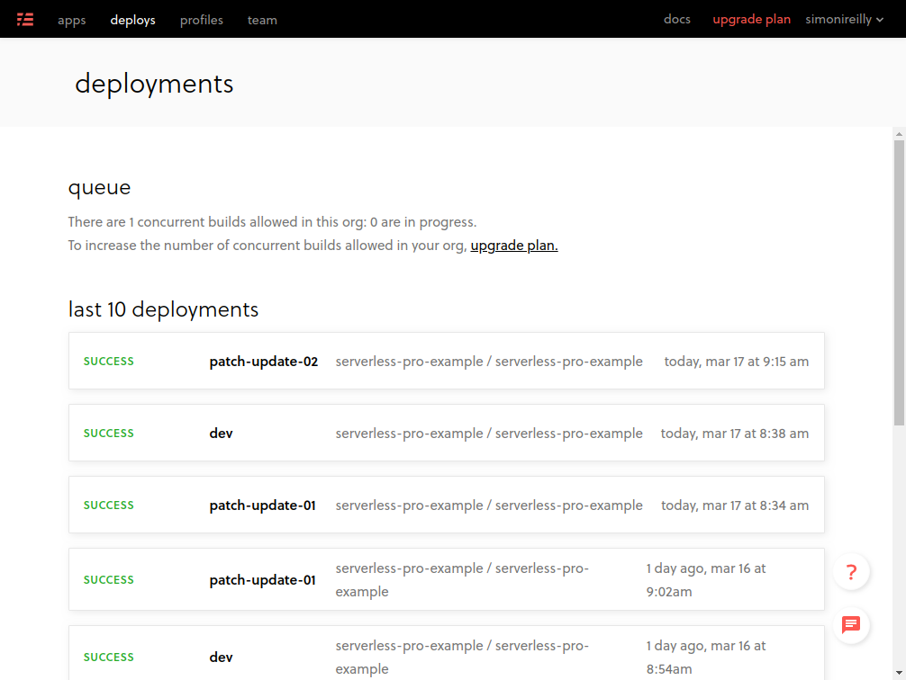
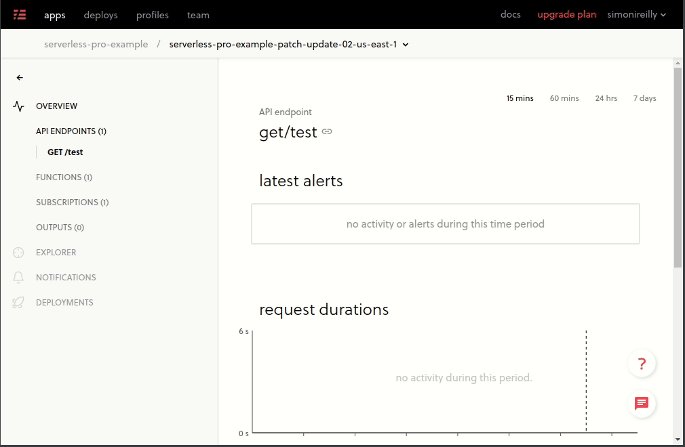
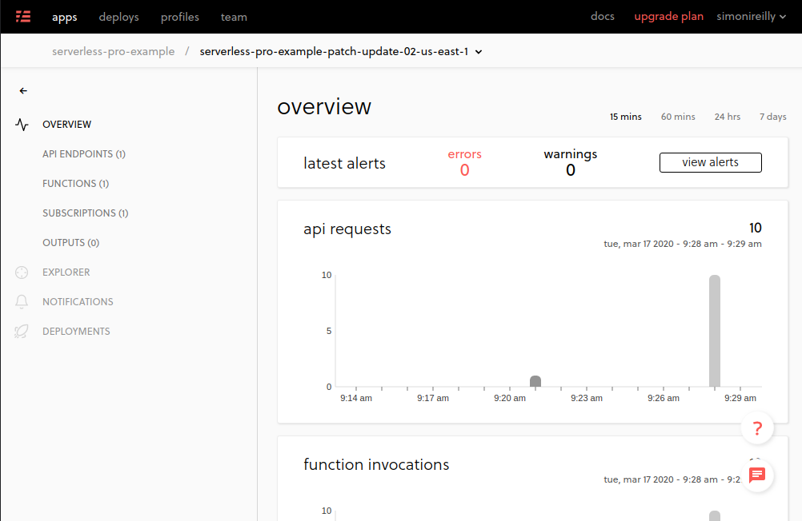
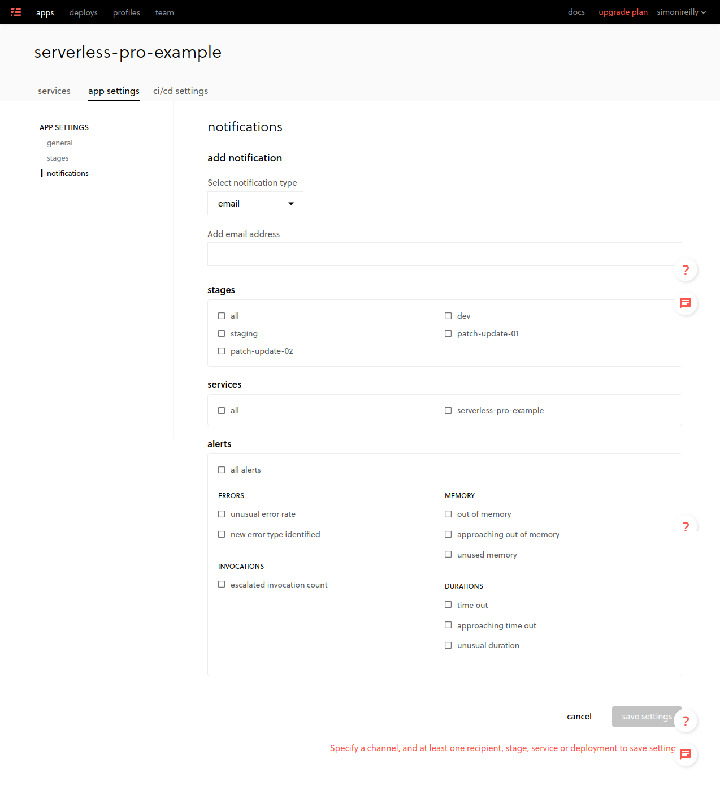

# Serverless Pro Example

- [Serverless Pro Example](#serverless-pro-example)
  - [Requirements](#requirements)
  - [Getting Started](#getting-started)
    - [Account Setups](#account-setups)
    - [Creating a Service](#creating-a-service)
    - [Automated Deploys](#automated-deploys)
    - [Testing from Serverless PRO Dashboard](#testing-from-serverless-pro-dashboard)
    - [Analytics](#analytics)
    - [Alerts](#alerts)

## Requirements

- A Github Account.
- An AWS Account:
  - If you need to sign up one you will need a credit card.

## Getting Started

### Account Setups

- **Fork this repository**
- After that head to your AWS account a login [https://aws.amazon.com/](https://aws.amazon.com/).
- Next head over to the [https://dashboard.serverless.com](https://dashboard.serverless.com)
  - Click Login with Github and complete the authorization.

### Creating a Service

You are now in the serverless dashboard and here you can Add Apps.

> Apps can contain many services (e.g. many serverless.yml declarations, and be deployed to multiple stages!)

- Click the `Add App` button
- Select a _deployment profile_ and _name_ the App
  - If you don't have a _deployment profile_ you can click the profiles button to get started.

Our first service will be connected to _Github_ and to our _AWS Account_.

- Click `Add Service` and proceed through the GUI.
  - > If you can't see the serverless github connection, you'll need to click on _install the Serverless application_ on Github button.
  - Select your fork of this repository and enable the following:
    - Deploy to default stage from master
    - _Advanced Settings_
      - Deploy branches to a stage named after the branch.
    - Save this configuration and head into the Application _Services_ tab.

### Automated Deploys

Now the app is configured it will need to be deployed. If it hasn't already you can click on the service under all services and click deploy. This will pull the app from github master branch and deploy it.

Automated deploys will occur on Github branches, but there is a caveat - **branch names should be small!!**. The IAMRole name of Cloudformation is limited to 60 characters, **and this appends the app name e.g. `serverless-pro-example#{github_branch_name}`**.

Lets create a branch locally and push it to get a deploy.

```
git checkout -b patch/update-01
git commit --allow-empty -m "Trigger deploy"
git push
```

Once you open up a Pull request you will see the deploy is happening in an automated way.



Each of these is a separate stage, and you can hop onto the application tracking.

### Testing from Serverless PRO Dashboard

When deploying a branch you can get a temporary URL and can debug using any API client.



### Analytics

You get a dashboard for every stage that you deploy which can be unique for your branch.

The data is scraped out of AWS by the serverless CloudFormation setup, and set to the dashboard, so there is a little lag.



### Alerts

Alerts are configured at the Application level and will **apply to all services inside the Application**.



You can notify through Slack or Email.

_These alerts are not exception trackers like Sentry, they are performance monitors like for lambda_
